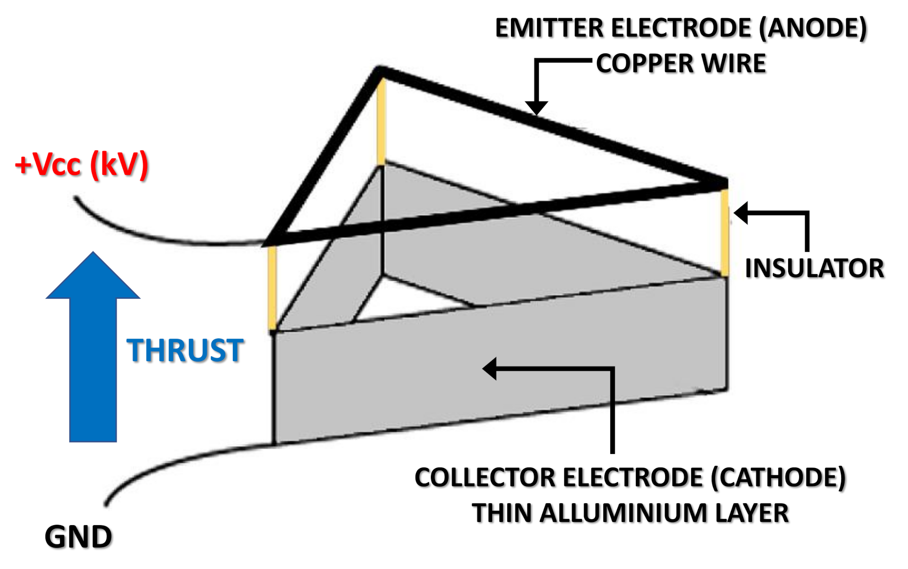

# Simulation of Ionic propulsion for NIMBUS 2k23 

## Project details:
The Ionic Thruster project, undertaken by the Departmental Team Abraxas as part of Nimbus 2K23, aimed to design, develop, and demonstrate an innovative ionic propulsion system. This cutting-edge project pushed the boundaries of conventional propulsion technologies by harnessing the principles of ionization and electrostatic acceleration to achieve efficient and precise thrust generation. The project, named "Project Abyss," showcased the team's expertise in engineering, innovation, and collaboration.

## Introduction:
Project Abyss was conceptualized to address the growing need for advanced propulsion systems that can enable precise control and maneuverability in space exploration. Ionic thrusters offer significant advantages over traditional chemical propulsion systems, including higher specific impulse, fuel efficiency, and reduced propellant consumption. The project aimed to showcase the viability of this technology in real-world applications.

## Project Objectives:
1. Design and fabricate a prototype ionic thruster capable of generating controlled thrust.
2. Optimize the thruster's efficiency and performance through rigorous testing and experimentation.
4. Present the working prototype at Nimbus 2K23 to showcase the potential of ionic propulsion in space exploration.

## Challenges Faced:
1. Ensuring reliable ionization and acceleration of particles for consistent thrust.
2. Developing control algorithms that balance power consumption and thrust modulation.
3. Addressing potential instabilities in the plasma generated within the thruster.

## Results and Impact:
Project Abyss successfully developed a functional ionic thruster prototype that demonstrated controlled thrust generation and maneuverability. The project's outcomes showcased the team's dedication to innovation and highlighted the potential of ion propulsion systems in revolutionizing space exploration. The prototype's performance data, control algorithms, and design insights contributed to advancing ion propulsion technology.

## Conclusion:
Project Abyss exemplified the capabilities of the Departmental Team Abraxas in pushing the boundaries of aerospace technology. By creating a functional ionic thruster prototype, the team showed that innovative propulsion systems are within reach. The project's impact extended beyond Nimbus 2K23, inspiring future research and development in the field of ion propulsion and space exploration.

##  Links to resources and research Paper reference:
1. [https://youtu.be/mnCmvxt2jn8 ](https://youtu.be/mnCmvxt2jn8 )

2. [https://youtu.be/nrEBoPYS4ns](https://youtu.be/nrEBoPYS4ns)

3. [https://youtu.be/f5biO4ND-IY](https://youtu.be/f5biO4ND-IY)

4. [https://www.youtube.com/@KraussEMUS1/videos](https://www.youtube.com/@KraussEMUS1/videos)

5. [https://upcommons.upc.edu/bitstream/handle/2117/103042/REPORT_255.pdf](https://upcommons.upc.edu/bitstream/handle/2117/103042/REPORT_255.pdf)

